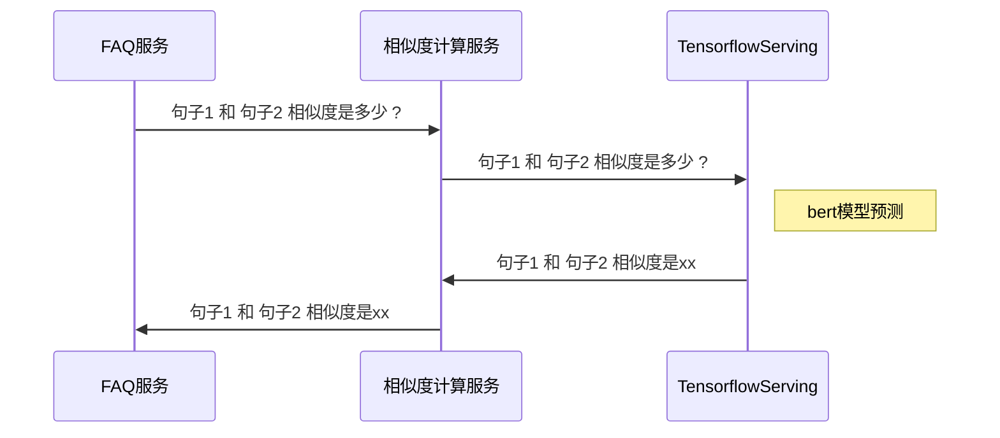

#### 什么是模型

​    首先算法是一个函数，比如：$y = wx + b$, 其中$w,b$ 是函数的参数，参数的值是不确定的，需要通过训练才能得到。得到这些参数以后就是模型了，如：$y = 2x + 3$；

​    需要说明的是，有时候我们说“模型”可能并不是指具体的模型，而是说一种算法。比如今天的主题：BERT模型，其实说的是一种算法。

​    更近一步，我认为我们写代码时，定义的函数都算是模型。比如下面这个计算积分的函数也是一个模型

```
def calculateCredit(loginTimes, articleNum):
    return 2*loginTimes + 10*articleNum
```

​    总结来看：模型 = 参数 + 算法

#### BERT模型简介

1. 首先BERT模型也是一个函数 $y = f(x)$ ，我们先看下输入$x$ :
   
   1. $x$ 可以是一段话（分类），比如：a=帮我查快递；也可以是两段话（相似度计算），比如：a=帮我查快递, b=我想查快递， 下面以两段话的输入为例
   
   2. ```
      帮我查快递
      我想查快递
      ```
   
   3. 对输入进行分词，BERT中的分词算法叫wordpiece，对于中文就是一个字符算一个词
      
      ```
      帮 我 查 快 递
      我 想 查 快 递
      ```
   
   4. 把词编码成id 称为：input_ids, 另外还有两个向量, 段落向量：segment_ids, 遮盖向量：mask_ids
      
      ```
      假设输入长度为16
      词典：[PAD, CLS, SEP, 帮, 我, 查, 快, 递, 想]
      tokens:     [CLS, 帮, 我, 查, 快, 递, SEP, 我, 想, 查, 快, 递, SEP]
      input_ids:  [1, 3, 4, 5, 6, 7, 2, 4, 8, 5, 6, 7, 2, 0, 0, 0]
      segment_ids:[0, 0, 0, 0, 0, 0, 0, 1, 1, 1, 1, 1, 1, 0, 0, 0]
      mask_ids:   [1, 1, 1, 1, 1, 1, 1, 1, 1, 1, 1, 1, 1, 0, 0, 0]
      label_ids:  [1]
      
      CLS 和 SEP 是用于分割两句话的, 后面多出的0 是由于BERT输入长度固定，长度比较短的句子需要对齐
      ```
   
   5. 对每个input_id进行embedding，BERT中把input_id映射成768维的向量。embedding结束,对于一个输入$x$ 就得到了一个矩阵
   
   6. 将分段segment embedding 和 位置 position embedding 加入到 input_id embedding中得到了最终的 $x$ 的embedding, 下面说$x$ 时不做特殊说明都是指 $x$ 的 embedding

2. 第二步构建transformer模型（关于transformer的理解[参见](https://jalammar.github.io/illustrated-transformer/)），首先给出模型的主要公式：
   
   1. $Q=W_q * X;K=W_k * X;V=W_v * X;$
   2. $Z_i=softmax({Q_i * K_i \over \sqrt{d_k}}) * V_i$
   3. $Z=(concat(Z_i))*W_o$
   4. $Wq$ 是一个查询矩阵，把输入 $x$ 变换成查询矩阵 $Q$;
   5. $W_k$ 是一个被查询的矩阵，把输入$x$ 变换成被查询的矩阵 $K$;
   6. $W_v$ 是一个值矩阵，把输入$x$ 变换成一个值矩阵 $V$;
   7. $Q * K$ 是用于计算相似度的，如果$Q$中的值和K中的值相关，那么他们的积就大，如果不想关就小。 乘积的结果还是一个矩阵，代表着每一个$x_i$ 对每一个 $x_j$的关注度，就是BERT所说的attention_score
   8. $d_k$ 是每个attention_head ($Q_i$) 的维度，一个attention_head 会计算出一个attention_score, 公式中除以$\sqrt{d_k}$ 原因没有追踪过，一般这种做法都是为了反向传播求梯度方便搞的
   9. 把mask_ids对应的每一个$x_i$ 的attention_score 都减去10000.0，目的是为了不让 $x_i$ attention到mask部分
   10. 对于每个$x_i$ 的attention_score向量做softmax归一化，得到attention_prob，表示对$x_j$ 的关注程度
   11. 将attention_prob 乘 $V_i$ 得到新的$x$ 的表示 $Z_i$, $Z_i$ 是一个attention_head 的结果
   12. 将多个attention_head 的结果$Z_i$ 进行拼接，拼接后乘上$W_o$ 矩阵，该矩阵表示多个attention_head 如何融合到一块，得到最终的矩阵$Z$ 也就是$x$ 的表示
   13. 对输出的$Z$ 进行dropout 正则化，然后再进行层归一化，加一个全连接层将每一个$x_i$ 变换为3072维度的向量，再接一个全链接层将每一个$x_i$ 变换会768维的向量；再进行dropout正则化，然后层归一化。
   14. 将上面1-13步重复12次，得到12个$Z$ (每层一个)，取最后一层的$Z_l$，取 $Z_l$ 的的第一行，也就是$x$ 的第一个词 CLS 的编码，接一个全链接层，作为最终的CLS编码。我们fine-tuning时 会使用这个最终的CLS 编码，接上我们一层，不如相似度计算时，加上一层全链接层（神经元个数为1），神经元的输出即是我们要的相似度计算结果。
   15. 最后通过平方差损失函数$(y_i - y_{predi})^2$计算损失，反向传播调整参数。其中$y_i$ 由label_ids给出

#### 使用BERT模型

​作为Java后端，使用BERT模型主要考虑了两种方式：

1. Java JNI：基于自己的GPU手动[编译][1]一个合适的*libtensorflow*和*libtensorflow\_jni\_gpu*（如果你的配置和官方一致就不需要自己编译 了，自己编译太多坑，这里有一份[经过验证的编译环境配置][2]）打成jar包并加入到工程依赖，使用tensorflow提供的Java API加载bert模型, 在你的[java工程中使用][3]

2. docker + nvidia-docker + tensorflow-serving: 需要一个合适的tensorlfow serving 的 image，这里有一份[官方做好的image列表][4], 当然你也可以[自己做一个][5]

​以上两种方式各有优缺点，主要考虑以下几个方面：

- 性能：通过对两种方案进行实验，tensorflow-serving 是C++写成的服务，对于[batch做过优化][6]，性能优于Java JNI

- 多模型支持能力：方案2是支持多模型的，也就是多个模型共用一个GPU, 方案1不支持

- 简单好部署：两种方案都不复杂

- 与现有服务开发和运维体系兼容性：方案1更有优势

- 方案2支持多模型、模型多版本、模型的冷启动和[热加载][7]。

​综合考虑建议使用方案2进行模型部署，以问答系统为例，调用时序图如下



​这里抽象出一个相似度计算服务，以便于集成多种相似度计算方法

#### 注意事项

后处理：这种模型的一个主要问题是，模型并不能完美解决所有问题，时不时总会有bad case出现，一旦模型上线，如果有问题无法及时解决（训练模型和上线都会消耗大量时间）。为此需要提前设计增加后处理，以便于出现问题时能够及时干预，解决问题。

预训练：bert 预训练的模型使用的数据来源于维基百科，与实际业务应用场景可能不一致。可以猜想如果在bert原有pre-training模型的基础上，使用业务数据再次进行pre-training 应该会更好。需要指出的是，我们做过这样的实验，结论是影响不大，可能是数据不够多。

数据标注：GPT2.0 的出现再次证明了要想得到好的模型，不仅要有数据量，还要提高数据的品质。所以注意标注质量哦。

#### 其他模型

1. BERT Google AI Language 出品，主要内容如下：
   1. 训练数据：BooksCorpus和维基百科的数据
   2. 模型改进：对输入使用了input_ids embedding + segment embedding + position embedding; 采用transformer encoder （self attention）方法
   3. 训练任务：MLM(masked language model)随机mask 15%的词，其中80%的概率替换为[MASK] 标记，10%的概率替换为随机的一个词，10%的概率保持不变; next sentence predict 下一句预测
   4. 训练方法：使用了Adam优化器
2. NEZHA（哪吒） 华为诺亚方舟实验室出品，主要内容如下：
   1. 训练数据：中文维基百科、中文新闻、百度百科
   2. 模型改进：原始BERT模型在embedding层使用了可学习的参数化的位置编码，NEZHA 在没一层都使用了不可学习的相对位置编码
   3. 训练任务：引入了全词Mask技术，称为WWM(whole whor mask), 同时借鉴SpanBERT，NEZHA 引入Span预测任务，该任务Mask一个连续的span，并利用span前后两个字的最上层表示和待预测字的位置信息来预测待预测字
   4. 训练方法：采用了混合精度（Mixed Precision Training）训练，优化器使用了LAMB（适合大Batch Size 训练模型）
3. TinyBERT 华为诺亚方舟实验室出品，主要内容如下：
   1. 提出一种transformer 蒸馏方法，为TinyBERT 引入两阶段学习框架，该框架在与训练阶段和特定任务学习阶段都执行transformer蒸馏方法。模型比BERT小7.5倍，推理速度快9.4倍
4. ALBERT Google lab 出品，主要内容如下：
   1. 训练数据：BOOKCORPUS 和 Wikipedia 数据集
   2. 模型改进：**嵌入向量参数化的因式分解**，词嵌入参数$O(V*H) $降低到了$O(V*E + E*H)$ 当H远大于E的时候参数量降低明显；**跨层参数共享**，ALBERT 采取了共享所有层的所有参数，极大的降低了参数量，使得ALBERT 从一层到另一层的转换要比 BERT 平滑得多；**句间连贯性损失**，使用了句子顺序预测（SOP）损失函数，它会避免预测主题，而只关注建模句子之间的连贯性
5. XLnet CMU 与谷歌大脑出品，主要内容如下：
   1. 训练数据：BooksCorpus和英文的维基百科、Giga5(16GB)、ClueWeb 2012-B和Common Crawl的数据、对于ClueWeb 2012-B和Common Crawl的内容使用了启发式的规则进行了预处理
   2. 模型改进：引入Permutation Language Model的训练目标，具体而言，XLNet采取了Attention掩码的机制，具体实现的时候，XLNet是用“双流自注意力模型”实现的。为了提高训练效率，只选择最后的$1/K$ 进行预测；采用transformer XL 通过对Segment状态cache并重用；使用相对位置编码，Attention计算的时候利用当前Query和Key的相对位置；segment编码也采用了可学习的embedding，同一个segment $s_{ij}=s_+$，不同的segment $s_{ij}=s_-$，这样它就能学到当i和j都属于某个segment的特征和i和j属于不同segment的特征；由于使用了双流自注意力模型，所以自然的消除了BERT中mask词条件独立的假设；
   3. 训练任务：与BERT一样建模两个segment; 不同之处在于取消了next sentence 任务
6. ERINE1.0 百度出品，主要内容如下：
   1. 训练数据：百科类、资讯类中文语料、论坛对话类数据
   2. 模型改进：预训练阶段仍旧采取字输入，但是Mask对象是单词(引入的 phrase & named entity 知识增强 masking 策略)
7. **ERNIE2.0 百度出品**，主要内容如下：
   1. 训练数据：英文数据是维基百科和 BookCorpus，另有一部分来自 Reddit，此外，百度使用 Discovery 数据作为篇章关系数据；中文数据则包括来自百度搜索引擎的百科、新闻、对话、信息检索和篇章关系数据
   2. 模型改进：基于持续学习的语义理解预训练框架；构建了多个预训练任务，试图从 3 个层面去更好的理解训练语料中蕴含的信息：**Word-aware Tasks**: 词汇 (lexical) 级别信息的学习，**Structure-aware Tasks**: 语法 (syntactic) 级别信息的学习，**Semantic-aware Tasks**: 语义 (semantic) 级别信息的学习；ERNIE 2.0 会带有一个嵌入叫Task Embedding，这个嵌入对于不同的任务都是唯一的，因此在精调的过程中模型能清楚地知道目前预训练的任务到底是什么；在百度深度学习框架 PaddlePaddle 中实现
   3. 训练任务：使用多任务学习增量式构建预训练任务。新构建的预训练任务类型可以无缝的加入训练框架，持续的进行语义理解学习。 通过新增的实体预测、句子因果关系判断、文章句子结构重建等语义任务，语义理解预训练模型从训练数据中获取了词法、句法、语义等多个维度的自然语言信息，极大地增强了通用语义表示能力。
      + **Knowledge Masking Task** 
      + **Capitalization Prediction Task** 
      + **Token-Document Relation Prediction Task** 
      + **Sentence Reordering Task** 
      + **Sentence Distance Task** 
      + **Discourse Relation Task** 
      + **IR Relevance Task**
8. GPT OpenAI 出品，主要告诉我们：训练数据要追求量大，质好，花样多
9. RoBERTa Facebook AI和华盛顿大学的研究团队共同完成，主要内容如下：
   1. 概述：用更多的数据，采取更精妙的训练技巧，训练更久一些
   2. 模型改进：调整了一些训练参数；删除下一句预测的目标；动态改变应用于训练数据的masking模式；将序列限制为来自单个文档(doc - sentence)
   3. 训练方法：对模型进行更长时间、更大批量、更多数据的训练；对较长序列进行训练；
   4. 贡献：提出了一套重要的BERT设计选择和训练策略，并引入了能够提高下游任务成绩的备选方案;使用一个新的数据集CCNEWS，并确认使用更多的数据进行预训练可以进一步提高下游任务的性能;训练改进表明，在正确的设计选择下，预训练的masked language model与其他所有最近发表的方法相比都更具有竞争力。
10. MT-BERT 美团NLP部出品，主要内容如下：
    1. 训练数据: 通用中文语料基础上加入大量美团点评业务语料，融入知识图谱中的实体信息
    2. 模型改进：在美团内部开发的AFO[16]（AI Framework On Yarn）框架进行MT-BERT预训练，混合精度实现训练加速（混合精度训练的模型效果略有降低）；**模型轻量化** 尝试了模型裁剪和剪枝，在进行模型蒸馏实验；设计了基于MT-BERT的多任务分类模型
    3. 应用场景：**细粒度情感分析** 判断评论文本在各个属性上的情感倾向；**Query意图分类 ** 对用户搜索意图进行识别，如美食、酒店、演出等等；**推荐理由场景化分类** 对于搜索以及推荐列表展示出来的每一个商家，我们会用一句自然语言文本来突出商家的特色和卖点，从而让用户能够对展示结果有所感知；**句间关系** 计算Query改写前后的相似度；**序列标注** 用于实体识别；
    4. 未来工作：**一站式MT-BERT训练和推理平台建设**；**融入知识图谱的MT-BERT预训练**；**MT-BERT模型的轻量化和小型化**
11. **ELECTRA**
    1. 模型改进：生成器主要起到生成 masked token 的作用，不仅顺手解决了两阶段 mismatch 的问题，而且还通过共享 token embedding 提升了学习效率，再将生成器调整为小型从而帮助判别器更有效地进行对抗学习。而判别器主要是通过对所有输入 token 的二分类任务，使模型不仅能从所有 token 中学习，而且二分类任务计算成本低学习难度小，不需要对完整的数据分布进行建模
    2. 理解：通过训练一个生成mask token模型，再让判别器去判断每一个token是否被替换过，一个好处是把模型更容易关注到难以学习的token，还有就是提高了学习的效率，BERT中一个batch过来，模型只能学习15%被mask token，**ELECTRA** 一个batch过来可以学习所有的token。这样的结构还有一个好处，自然的解决了两阶段mismatch的问题
12. T5 Google出品
    1. 简介：把最近的一些研究成果都用上了，简单一句话，大力出奇迹
    2. 训练数据：搞了一个又大又干净的数据C4
    3. 模型改进：简单说是一个模型搞定所有任务，就是把任务信息编码到了模型中；位置编码也使用了相对位置编码；
13. UNILM 微软出品
    1. 模型改进：单向LM；Seq2Seq LM，输入两句。第一句采用BiLM的编码方式，第二句采用单向LM的方式
    2. 训练方法：优化目标的分配是1/3的时间采用BiLM和Next sentence，1/3的时间采用Seq2Seq LM，1/6的时间分别给从左到右和从右到左的LM
14. MASS 微软出品
15. BART Facebook 出品

#### 参考链接

1. [NEZHA & TinyBERT](https://mp.weixin.qq.com/s?__biz=MzI0ODcxODk5OA==&mid=2247511328&idx=1&sn=db1427f97863d89ceeeb510a781e86d4&chksm=e99e9ed9dee917cf9c70edb461d50938be8b418821eb04e5dda3f6fd7b73e621b975ac8f9c1a&mpshare=1&scene=23&srcid=1216d1UTBX8iMgOapqkVW3qP&sharer_sharetime=1576480080275&sharer_shareid=8068011f2378e76cde606218dac62965%23rd)
2. [ALBERT](https://www.toutiao.com/i6740836555612488204/?tt_from=mobile_qq&utm_campaign=client_share&timestamp=1576480807&app=news_article&utm_source=mobile_qq&utm_medium=toutiao_android&req_id=20191216152007010129034032060CB731&group_id=6740836555612488204)
3. [XLnet](http://fancyerii.github.io/2019/06/30/xlnet-theory/)
4. [ERNIE](https://mp.weixin.qq.com/s?__biz=MzA3MzI4MjgzMw==&mid=2650766995&idx=1&sn=c0e98479f55eebc64de588ae778988a2&chksm=871abaedb06d33fba9eee9c368255eeb41359523c4ea4049dadb304bafcf5c9634919c5b4be2&mpshare=1&scene=23&srcid=12164lExkBEXiQKUUVEVtXK1&sharer_sharetime=1576490504306&sharer_shareid=8068011f2378e76cde606218dac62965%23rd)
5. [ERNIE github](https://github.com/PaddlePaddle/ERNIE/blob/develop/README.zh.md#ernie-10-enhanced-representation-through-knowledge-integration)
6. [ELECTRA](https://zhuanlan.zhihu.com/p/90494415?utm_source=qq&utm_medium=social&utm_oi=846170485329891328)
7. [RoBERTa](https://mp.weixin.qq.com/s?__biz=MzI3MTA0MTk1MA==&mid=2652050307&idx=1&sn=27e7cc8089173c3861edc5464eab8a8b&chksm=f1206772c657ee64fb0c370cab47ef010f392f85523589b766388daf8ff3751e65f622190a6f&mpshare=1&scene=23&srcid&sharer_sharetime=1564452978806&sharer_shareid=8068011f2378e76cde606218dac62965%23rd)
8. [MT-BERT](https://www.toutiao.com/i6759133530220921351/?tt_from=mobile_qq&utm_campaign=client_share&timestamp=1576490989&app=news_article&utm_source=mobile_qq&utm_medium=toutiao_android&req_id=201912161809490101290320992519EC00&group_id=6759133530220921351)
9. [GPT](https://zhuanlan.zhihu.com/p/56865533)
10. [GPT-2.0 github](https://github.com/openai/gpt-2)
11. [T5](https://zhuanlan.zhihu.com/p/89719631)

#### 名词解释

1. BERT : **B**idirectional **E**ncoder **R**epresentations from **T**ransformers
2. ERNIE : **E**nhanced **R**epresentation through k**N**owledge **I**nt**E**gration
3. XLNet : XL取自 Transformer-XL 表示 extra long
4. NEZHA: NEural contextualiZed representation for CHinese lAnguage understanding
5. TinyBERT : Tiny BERT
6. GPT : 可能是这个意思：Generative pre-trained Transformer from OpenAI
7. RoBERTa: **R**obustly **o**ptimized **BERT** **a**pproach
8. GLUE : **G**eneral **L**anguage **U**nderstanding **E**valuation
9. GloVe : **Glo**bal **Ve**ctors for Word Representation
10. ELMO : **E**mbeddings from **L**anguage **Mo**dels
11. ELECTRA : **E**fficiently **L**earning an **E**ncoder that **C**lassifies **T**oken **R**eplacements **A**ccurately
12. GAN : **G**enerative **A**dversarial **N**ets
13. T5 : **T**ext-**t**o-**T**ext **T**ransfer **T**ransformer
14. UNILM : Unified Language Model Pre-training for Natural Language Understanding and Generation
15. MASS : Masked Sequence to Sequence Pre-training for Language Generation

[1]: https://github.com/tensorflow/tensorflow/blob/master/tensorflow/java/README.md
[2]: https://www.tensorflow.org/install/source#tested_build_configurations
[3]: https://github.com/tensorflow/tensorflow/blob/master/tensorflow/java/README.md
[4]: https://hub.docker.com/r/tensorflow/serving/tags
[5]: https://github.com/tensorflow/serving/blob/master/tensorflow_serving/g3doc/building_with_docker.md
[6]: https://github.com/tensorflow/serving/tree/master/tensorflow_serving/batching
[7]: https://www.tensorflow.org/tfx/serving/serving_config
[8]: https://arxiv.org/abs/1906.08237