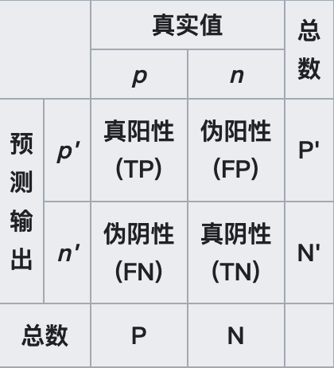
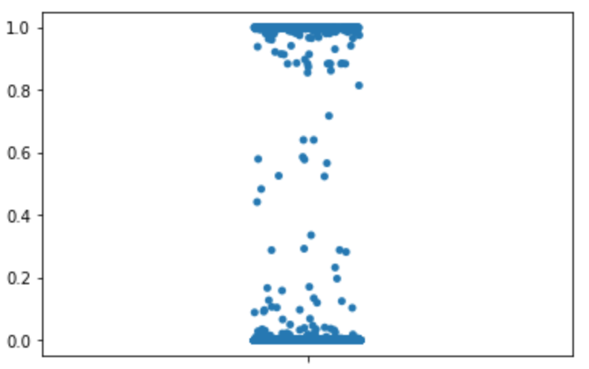
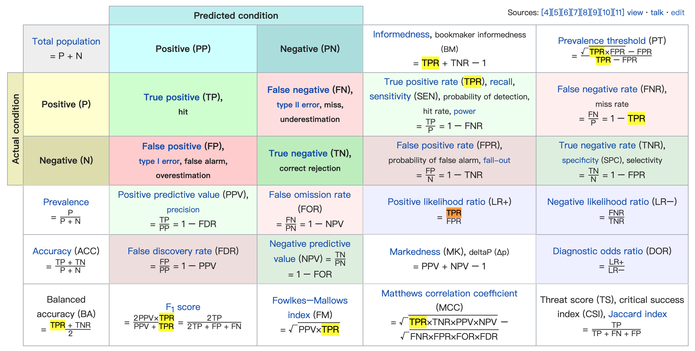
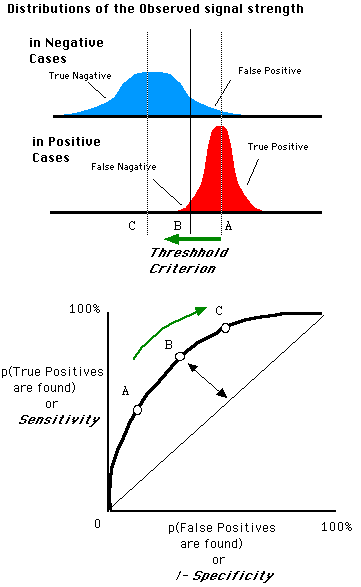
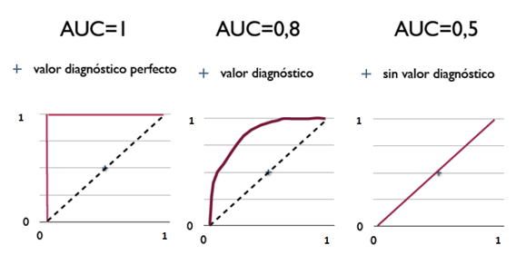

搞机器学习、深度学习的工程师们每训练一个模型总要面对一个问题：这个模型跟上个模型比更好吗？为此需要有一套评价指标，客观评价模型的好坏。下面介绍一下分类模型评测中用到的一些指标

#### 操作系统

```
lsb_release -a

output:
Distributor ID:    Ubuntu
Description:    Ubuntu 20.04.4 LTS
Release:    20.04
Codename:    focal
```

#### 混淆矩阵（Confusion Matrix）

混淆是说模型是否混淆了类别，混淆矩阵就是通过一个矩阵能轻松看出模型是否混淆了类别。如下是一个2 x 2的混淆矩阵：



四个统计量意义：

TP: 预测为真实际为真，所以叫真阳性

FP: 预测为真实际为假，所以叫假阳性

TN: 预测为假实际为假，所以叫真阴性

FN: 预测为假实际为真，所以叫假阴性

如果TP 跟 FP数量差不多，TN和FN数量差不多，就可以说模型混淆了类别，类似于随机猜测了，模型效果显然不好。

如果模型没有混淆类别，那么还需要进一步分析模型到底有多好

#### 准确率（Accuracy）

准确率或者叫正确率，是一个综合指标，计算公式：$acc=\frac{TP+TN}{TP+FP+TN+FN}$ ，只是简单统计预测对的数据量 占 所有预测数据量的比例

这个指标有个问题，就是在正负类数据严重不均衡时，该指标基本没有意义，比如：$P=100$, $N=9900$，模型(M_0)不需要训练，直接预测为负类即可。混淆矩阵为：

| \\      | $p$    | $n$     |
| ------- | ------ | ------- |
| $p^{'}$ | tp=0   | fp=0    |
| $n^{'}$ | fn=100 | tn=9900 |

此时$acc=\frac{9900}{10000}=99\%$ 

这个准确率已经很高了，但没有意义，所以需要一个指标能给出正负类的准确率，而不是一个综合性指标

#### 精确率（Precision）

先给出计算公式：$pre=\frac{TP}{TP+FP}$ 从公式看出该指标是指：真阳性 占 所有识别为阳性 数据量的比例，其实就是预测阳性准确率。此时对$M_0$评测：

$pre=\frac{0}{0+0+epsilon}=0$ 其中$epsilon$ 是一个小数，避免分母为$0$

在分类任务中，预测结果($predictions$) 通常是一个数字，我们可以取一个阈值($thresholds$)，将高于阈值的算作阳性，低于阈值的为阴性。



上图是一个真实的预测结果分布图，阳性阴性都在这个图中，我们选择 $thresholds$ 就是要在 $y$ 轴 $(0,1)$ 之间划一条横线，横线上方的为阳性，下方为阴性。可以看出数据是向两端集中的，通常提高阈值，$pre$ 增大，但是单纯的提高阈值，则 $TP$ 也将减少。即使模型能够百发百中，没有量依然没有用。所以还需要一个指标：召回率

#### 召回率（Recall）

先上公式：$rec=\frac{TP}{TP+FN}$ 该指标是指：真阳性 占 所有阳性 数据量的比例。此时对$M_0$评测：

$rec=\frac{0}{0+100+epsilon}=0$

由此可见，在正负类数据严重不均衡时，精确率和召回率也能反映模型的好坏。我们习惯于用一个指标判断模型好坏，现在有两个指标，咋办呢？把两个指标柔和成一个的惯用手段就是取平均

#### F-score

取平均有多种方式：算数平均、几何平均、调和平均

算数平均：$=\frac{a+b}{2}$

几何平均：$=\sqrt{a \cdot b}$

调和平均：$=\frac{1}{\frac12 \cdot (\frac1a+\frac1b)}=\frac{2 \cdot a \cdot b}{a+b}$

其中调和平均数有个很好的特性：非常同情弱者（较小值），当然几何平均数也有这个特性，下面举几个例子：

| model | $pre$ | $rec$ | $\overline{x}$ | $g$    | $h$    |
| ----- | ----- | ----- | -------------- | ------ | ------ |
| m1    | 0.01  | 1     | 0.505          | 0.1    | 0.0198 |
| m2    | 0.5   | 0.7   | 0.6            | 0.5916 | 0.5833 |
| m3    | 0.9   | 0.8   | 0.85           | 0.8485 | 0.8471 |
| m4    | 1     | 0.01  | 0.505          | 0.1    | 0.0198 |

为什么不用平均数，有个直观的例子，$mean=\frac{我的钱+马云的钱}{2}=我们很富有$，显然这样的模型是有问题的

同情弱者就好吗？这跟我们的目标有关，我们的目标是同时关注两个指标，哪个都不能太低，所以调和平均数是可以的

F-score 就是使用调和平均数计算出来的。准确说是加权调和平均数，公式如下：

$F_{\beta} = (1 + \beta^2) \cdot \frac{precision \cdot recall}{\beta^2 \cdot precision + recall}$

其中$\beta$ 是指召回率权重是准确率权重的多少倍，详见参考链接[5]&[6]：

$F_1=\frac{2 \cdot p \cdot r}{p+r}$
$F_2=\frac{5 \cdot p \cdot r}{4 \cdot p+r}$
$F_{0.5}=\frac{1.25 \cdot p \cdot r}{0.25 \cdot p+r}$

为什么名字叫F-score呢？有回答说是来源于统计学家【罗纳德·费希尔 (Ronald Fisher）】的名字

#### 阳性召回率（TPR）

公式：$TPR=\frac{TP}{TP+FN}$ 看起来跟前面说的召回率一样，通常随着$thresholds$ 的降低，$TPR$ 将升高

#### 阴性错误率（FPR）

公式：$FPR=\frac{FP}{FP+TN}$ 指假阳性占所有阴性数据量的比例，通常随着$thresholds$ 的降低，$FPR$ 将升高

#### 其他指标

除了上述指标外，还有很多指标，具体如下：



#### Roc

前面说到$thresholds$，每取一个阈值，我们都能计算出两个指标 $TPR 和 FPR$. 把这两个指标画到平面直角坐标系中就是一个点。我们通过取不同阈值就能画出很多个点，将这些点连起来就是Roc曲线了。

Roc（Receiver operating characteristic curve）就是**接收者操作特征曲线**，名字不好理解，记住上面的解释就好了。

Roc曲线能够让我们更直观的看到阈值取到哪里更合适，理想的模型预测结果应该是Roc空间的左上角那个点，即$(0,1)$，代表着预测出了所有阳性且没有假阳性。模型如果只是随机的给出分数，则模型预测结果将是Roc空间中从$(0,0)$ 到 $(1,1)$ 对角线上的一个点。



阈值的选择可以选上图中B点所对应的阈值，这一点的切线与对角线平行，意味着TPR每升高一点，FPR也会升高相同的幅度。之后FPR 升高的速度将超过TPR，就得不偿失了

但是选在B点一定好吗？不一定，具体还要看我们的需求是更关注准确率呢还是更关注召回率。

#### Auc

ROC曲线下方的面积（Area under the Curve of ROC），由于Roc空间是个1 x 1的空间，Auc 的取值也就在$(0,1)$ 之间。其中Auc=1，意味着包括了Roc空间中左上角的点，这样的分类器属于完美分类器，一般是不存在的。



Auc的意义：对于一个给定的模型$M_n$，如果给定一个阳性样本$a$和一个阴性样本$b$，使用$M_n$ 给$a、b$ 进行打分得$a_s、b_s$ ，则$Auc=P(a_s > b_s)$

不理解没关系，记住Auc值越大越好

参考链接

[1] [混淆矩阵](https://en.wikipedia.org/wiki/Confusion_matrix)

[2] [ROC曲线](https://zh.wikipedia.org/zh-cn/ROC%E6%9B%B2%E7%BA%BF)

[3][理解调和平均数1](https://www.zhihu.com/question/23096098)

[4][理解调和平均数2](http://file.snnu.net/res/20124/24/b8ad47fd-aa61-4799-b288-a03d01228bda.pdf)

[5][INFORMATION RETRIEVAL](http://www.dcs.gla.ac.uk/Keith/Chapter.7/Ch.7.html)

[6][F-score](https://en.wikipedia.org/wiki/F-score)
