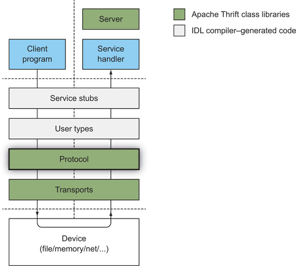
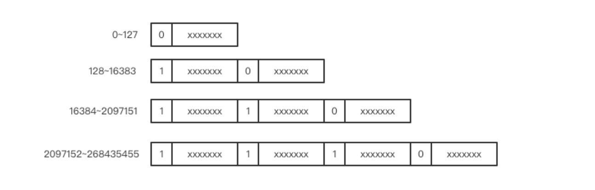
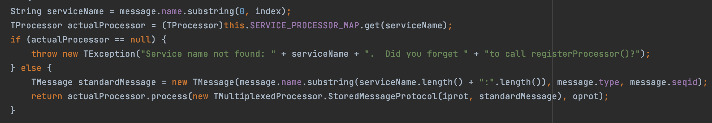

愚蠢的人写的代码只有计算机能懂，优秀的程序员写的代码人人都懂。---- Martin Fowler, 1999

从上一节中Thrift整体架构部分我们看到thrift框架被划分成了多层，每一层实现不同的功能，结构清晰明了。单纯从开发的角度看我们只需要利用生成的代码开发自己的业务就可以了，但是从学习的结果，我们还是希望了解更多。本节将介绍Thrift消息编码传递过程中用到的两类对象TProtocol和TTransport，以此窥探Thrift高性能的原因所在。

#### Thrift消息处理过程



如上图所示，User types和 Service stubs是根据我们定义的接口生成的代码，基于这个我们便可以编写上层的客户端和服务端程序。下面的Protocol和Transports是thrift提供的，我们只需要依赖相应语言的包就可以了。

#### Protocol 和 Transports 关系

Protocol和Transports共同完成了消息的编码和传输，他们都有多种类型可选。根据不同的选择Transports生成的数据流是不同的，Protocol层屏蔽了Transports的差异，向上提供了统一的接口，以使调用者无需关心消息编码和解码的细节。

#### Protocol 和 Transports 的简单使用

创建一个maven工程，加入如下依赖

```
<dependency>
    <groupId>org.apache.thrift</groupId>
    <artifactId>libthrift</artifactId>
    <version>0.15.0</version>
</dependency>
```

Hello World demo

```
public static void main(String[] args) throws TException {
    TMemoryBuffer trans = new TMemoryBuffer(1024);
    TBinaryProtocol proto = new TBinaryProtocol(trans);

    proto.writeString("hello world!");
    System.out.println("Wrote msgLen:" + trans.length());
    String readMsg = proto.readString();
    System.out.println("Read readMsg:" + readMsg);
}
```

本例Protocol使用了TBinaryProtocol，它将数据输出成byte的形式，在这过程中没有增加额外的信息（比如TJSONProtocol可能就需要增加`"`、`,`等）。上述writeString方法会先写一个4字节的整数，表示字符串长度，再写消息本身。所以我们看到输出的msgLen是16(4+12)。

本例Protocol使用了TMemoryBuffer，它仅仅将输入的byte存储在了内存中，没有做任何的整理。

#### Protocol 的子类型

##### TJSONProtocol

输出Json格式的byte数据，原字段名序列化到json时可以选择字段名也可以选择id

##### TSimpleJSONProtocol

与`TJSONProtocol`主要区别是：`TSimpleJSONProtocol`只写Json格式byte数据，不能读。从名字看该类输出的是SimpleJson, 简单在哪里呢，从代码看，一个简单的地方是数据类型上，比如输出数据中有个数字，`TSimpleJSONProtocol`的输出很常规，只有一个数字，而这个数字是i32还是i64不知道；`TJSONProtocol`会把类型信息也带上。`TJSONProtocol`输出字段时可以选择输出字段id; `TSimpleJSONProtocol`只能输出字段名。通常在Thrift以外，比如脚本中我们使用的是SimpleJson。

#### TBinaryProtocol

这是最简单的一个Protocol了，直接将数据转成byte形式，不像`TJSONProtocol`需要增加`"`、`,`、`{}`等，`TBinaryProtocol`没有多余的东西，为了节约，它不会直接将字段名转成byte，而是将字段ID转成byte。

##### TCompactProtocol

从名字看就知道该类运用了一些压缩技术，具体压缩方法有点类似于UTF-8编码。数据传输中要传递一些整数，这些整数有大有小，实践表明使用到的数字通常很小。如果所有整数都用4byte表示，显然有点浪费带宽。`TCompactProtocol`中使用了VarInt的压缩方法，具体如图：



使用byte中最高位的bit 记录后一个byte是否和当前byte同属于一个整数，1表示属于，0表示不属于。i64也使用了该压缩技术。

这里还有一个问题就是负数问题，大家都知道数字在计算机中是使用补码表示的，正数高位bit为0，负数高位bit为1

```
10000000 00000000 00000000 00000001  -1的原码
11111111 11111111 11111111 11111110  -1的反码
11111111 11111111 11111111 11111111  -1的补码
```

负数的问题就在于直接使用VarInt压缩，完全不起作用，还会增加空间占用。比如-1就需要5个byte表示。因此使用需要将负数映射成正数，映射方法被称为ZigZag，映射公式：`n << 1 ^ n >> 31` 例如-1映射结果为1，计算如下：

```
11111111 11111111 11111111 11111111  -1
11111111 11111111 11111111 11111110  -1 << 1
11111111 11111111 11111111 11111111  -1 >> 31
00000000 00000000 00000000 00000001  ^
```

那正数1呢，实际结合ZigZag名字就能知道所谓之字型映射就是：

```
0  => 0
-1 => 1
1  => 2
-2 => 3
```

还有一个压缩项，就是在两个字段ID差距比较小时，将字段ID表示成两个ID的差，然后再和字段类型一起用一个byte表示，对应的Java代码如下：

```
field.id - this.lastFieldId_ << 4 | typeToWrite
```

##### TTupleProtocol

该类是`TCompactProtocol`的子类，主要扩展出了两个方法`writeBitSet`、 `readBitSet`, 使用bit位表示是否设置了字段值，相对更节省空间（其他类型需要写fieldId、fieldType、fieldName等）

##### TProtocolDecorator

一个抽象类，但是没有提供抽象方法，目的是提供了一种简便的编写具体装饰器子类的方法。

##### TMultiplexedProtocol

`TMultiplexedProtocol` 允许 Thrift 客户端 调用多个Thrift 服务，通过在调用时传递服务名和方法名类实现，下面是客户端代码：

```
// This example uses a single socket transport to invoke two services:
TSocket transport = new TSocket("localhost", 9090);
transport.open();

TBinaryProtocol protocol = new TBinaryProtocol(transport);

TMultiplexedProtocol mp = new TMultiplexedProtocol(protocol, "Calculator");
Calculator.Client service = new Calculator.Client(mp);

TMultiplexedProtocol mp2 = new TMultiplexedProtocol(protocol, "WeatherReport");
WeatherReport.Client service2 = new WeatherReport.Client(mp2);

System.out.println(service.add(2,2));
System.out.println(service2.getTemperature());
```

这是服务端代码，服务端使用`TMultiplexedProcessor`处理，`TMultiplexedProcessor`允许一个服务实例提供多个服务

```
// To do so, you instantiate the processor and then register additional processors with it, as shown in the following example:
TMultiplexedProcessor processor = new TMultiplexedProcessor(); 
processor.registerProcessor( "Calculator", new Calculator.Processor(new CalculatorHandler())); 
processor.registerProcessor( "WeatherReport", new WeatherReport.Processor(new WeatherReportHandler())); 

TServerTransport t = new TServerSocket(9090);
TSimpleServer server = new TSimpleServer(processor, t); 
server.serve();
```

##### StoredMessageProtocol

`TMultiplexedProcessor`的一个私有内部类，从代码看，只有一个用途，就是存储一下解码后的message，以便后面无感知处理（因为前面为了判断调用的是哪个服务，已经从Stream中消费了数据）



[1]: https://livebook.manning.com/book/programmers-guide-to-apache-thrift "Programmer's Guide to Apache Thrift"
