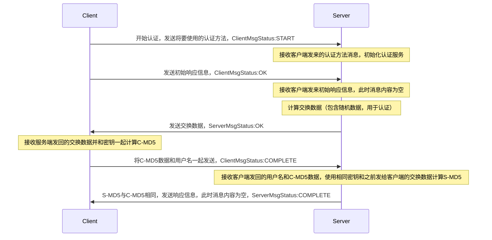

愚蠢的人写的代码只有计算机能懂，优秀的程序员写的代码人人都懂。---- Martin Fowler, 1999

前面介绍了Protocol 的子类型，本节将重点探讨一下Transports的子类型。

#### Transports 的子类型

##### TFileTransport

这个类(Java语言)提供了是否只读的参数，但实际只能读，而且不能搭配TProtocol使用。

##### TNonblockingSocket

非阻塞Socket，异步客户端的实现（主要代码）

```java
public static class AsyncClient implements AsyncIface {
    public static class Factory implements TAsyncClientFactory<AsyncClient> {
      private TAsyncClientManager clientManager;
      private TProtocolFactory protocolFactory;
      public Factory(TAsyncClientManager cm, TProtocolFactory pf) {
        this.clientManager = cm;
        this.protocolFactory = pf;
      }
      // 这里用到了 TNonblockingSocket
      public AsyncClient getAsyncClient(TNonblockingTransport t) {
        return new AsyncClient(protocolFactory, clientManager, t);
      }
    }
}
```

非阻塞Socket，异步服务端的实现（主要代码）

```java
public TNonblockingSocket accept() throws TTransportException {
    if (serverSocket_ == null) {
      throw new TTransportException(TTransportException.NOT_OPEN, "No underlying server socket.");
    }
    try {
      SocketChannel socketChannel = serverSocketChannel.accept();
      if (socketChannel == null) {
        return null;
      }
      // 这里用到了 TNonblockingSocket
      TNonblockingSocket tsocket = new TNonblockingSocket(socketChannel);
      tsocket.setTimeout(clientTimeout_);
      return tsocket;
    } catch (IOException iox) {
      throw new TTransportException(iox);
    }
}
```

需要注意的是thrift中客户端和服务端搭配使用(TTransport和TProtocol), 客户端和服务端尽量一致，不然可能会无法调用。

##### AutoExpandingBufferReadTransport

自动扩充缓存空间的读Transport，注意只用来缓存读取的数据，所以一般不单独使用，需要结合其他Transport一起使用，目前在TFastFramedTransport中有用

##### AutoExpandingBufferWriteTransport

自动扩充缓存空间的写Transport，注意只用来缓存写出去的数据，所以一般不单独使用，需要结合其他Transport一起使用，目前在TFastFramedTransport中有用

##### TSaslServerTransport

Sasl全称简单认证和安全层（Simple Authentication and Security Layer），是一种用来扩充C/S模式验证能力的机制。ServerTransport即表示服务端Transport。

##### TSaslClientTransport

与TSaslServerTransport对应，表示客户端Transport。这两个总是配对使用，而且两个类的父类是同一个，即：TSaslTransport

客户端服务端整个认证过程类似于TCP握手，下面结合代码具体看下

主要认证过程涉及代码：

```
//开始握手
handleSaslStartMessage(); 
readSaslHeader = true;

TSaslTransport.SaslResponse message = null;
// 循环处理，因为要有几轮交互
while (!sasl.isComplete()) {
    // 接收消息
    message = receiveSaslMessage();
    if (message.status != NegotiationStatus.COMPLETE && message.status != NegotiationStatus.OK) {
        throw new TTransportException("Expected COMPLETE or OK, got " + message.status);
    }

    // 处理握手信息
    byte[] challenge = sasl.evaluateChallengeOrResponse(message.payload);

    // 是否完成握手
    if (message.status == NegotiationStatus.COMPLETE && getRole() == TSaslTransport.SaslRole.CLIENT) {
        continue;
    }

    // 发送应答信息
    sendSaslMessage(sasl.isComplete() ? NegotiationStatus.COMPLETE : NegotiationStatus.OK, challenge);
}
```

其中client端handleSaslStartMessage涉及代码：

```
// 获取客户端
SaslClient saslClient = getSaslClient();

byte[] initialResponse = new byte[0];
if (saslClient.hasInitialResponse()) initialResponse = saslClient.evaluateChallenge(initialResponse);

// 开始认证，发送将要使用的认证方法，进入START状态
byte[] mechanismBytes = mechanism.getBytes(StandardCharsets.UTF_8);
sendSaslMessage(NegotiationStatus.START,mechanismBytes);
// 发送初始响应信息，进入COMPLETE状态
sendSaslMessage(saslClient.isComplete() ? NegotiationStatus.COMPLETE : NegotiationStatus.OK, initialResponse);
underlyingTransport.flush();
```

server端handleSaslStartMessage涉及代码：

```
// 开始认证，接收客户端发来的认证方法消息
TSaslTransport.SaslResponse message = receiveSaslMessage();

LOGGER.debug("Received start message with status {}", message.status);
if (message.status != NegotiationStatus.START) {
    throw sendAndThrowMessage(NegotiationStatus.ERROR, "Expecting START status, received " + message.status);
}

// 解析认证方法
String mechanismName = new String(message.payload, StandardCharsets.UTF_8);
TSaslServerDefinition serverDefinition = serverDefinitionMap.get(mechanismName);
LOGGER.debug("Received mechanism name '{}'", mechanismName);

if (serverDefinition == null) {
    throw sendAndThrowMessage(NegotiationStatus.BAD, "Unsupported mechanism type " + mechanismName);
}
// 根据客户端使用的认证方法，初始化认证服务
SaslServer saslServer = Sasl.createSaslServer(serverDefinition.mechanism,
        serverDefinition.protocol, serverDefinition.serverName, serverDefinition.props,
        serverDefinition.cbh);
setSaslServer(saslServer);
```

接下来服务端进入while循环，继续接收消息，这里不上代码了，总体交互过程如下(认证服务以CramMD5Server为例)：



认证服务除了上面提到的CramMD5Server以外还有很多，比如处理明文密码认证的SaslPlainServer；支持加密通讯的DigestMD5Server等等，可以根据需要进行选择。

##### TFramedTransport

调用write方法写数据出去时会先缓存下来，直到调用flush方法才会将数据一起发送出去。这一起发送的数据称为一帧。接收时直接按帧接收放到内存中，提高了发送和接收效率。

##### TFastFramedTransport

与TFramedTransport的主要差别为：TFastFramedTransport可以对缓存空间进行重用，而TFramedTransport每次flush后都会开辟新的空间。因此如果消息不是太大，应该使用此传输代替TFramedTransport。请注意这个实现不是线程安全的。

##### TSimpleFileTransport

它会将输入的byte存储写到文件中，或者从文件中读数据。

##### TMemoryBuffer

它仅仅将输入的byte存储在了内存中。

##### TMemoryInputTransport

它仅仅将输入的byte存储在了内存中，只支持读。

##### TSocket

用于网络传输，支持读写

##### TIOStreamTransport

比较基础的Transport，用于对输入输出流的包装，包装成Transport，以便于transport操作 

##### THttpClient

服务端是TServlet服务时使用

#### Thrift 消息类型

thrift有四种消息类型，如下：

```java
public static final byte CALL = 1;  // 发起调用
public static final byte REPLY = 2;  // 正常响应
public static final byte EXCEPTION = 3;  // 异常响应
public static final byte ONEWAY = 4; // 不需要响应
```

#### Thrift 数据类型

```java
public static final byte STOP = 0;    // 写字段数据结束标记，不会映射到任何数据类型
public static final byte VOID = 1;    // 空
public static final byte BOOL = 2;    // boolean类型，(true or false)
public static final byte BYTE = 3;    // 8位整数
public static final byte DOUBLE = 4;  // 64位浮点数
public static final byte I16 = 6;     // 16位整数
public static final byte I32 = 8;     // 32位整数
public static final byte I64 = 10;    // 64位整数
public static final byte STRING = 11; // 字符串
public static final byte STRUCT = 12; // 对象类型
public static final byte MAP = 13;    // map类型
public static final byte SET = 14;    // set类型
public static final byte LIST = 15;   // list类型
public static final byte ENUM = 16;   // 枚举类型
```

#### 发送消息过程：

消息：TMessage(methodName, type, ++seqid_)

- 传输调用方法开始消息

- 传输方法参数，两种：
  
  - StandardScheme
    
    - writeStructBegin
    
    - writeFieldBegin
    
    - writeXX
    
    - writeFieldEnd
    
    - writeFieldStop
    
    - writeStructEnd
  
  - TupleScheme
    
    - writeBitSet
    
    - writeXX

- 传输调用方法结束：通常没有任何操作，因为一般都通过length指定了数据的长度。对于TJSONProtocol，会加上"]"符号，保证Json格式完整

- 刷流：确保数据全部发送出去

#### 消息接收过程

消息接收过程基本是发送过程的逆过程，只是发送的改为接收。这里就不多说了

#### 参考资料

[1]: https://livebook.manning.com/book/programmers-guide-to-apache-thrift "Programmer's Guide to Apache Thrift"
