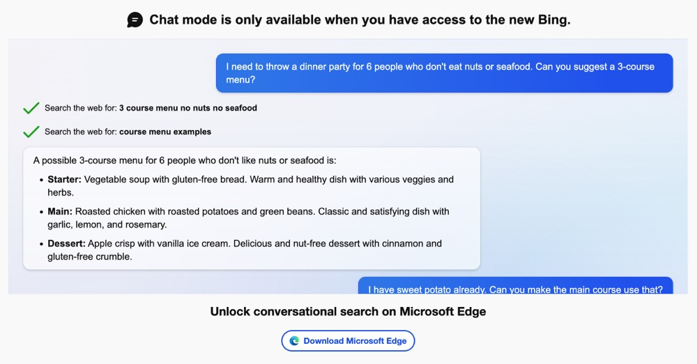
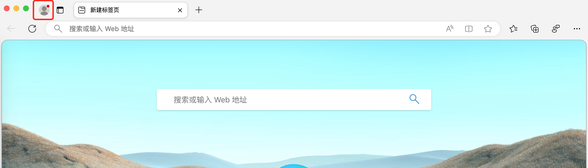
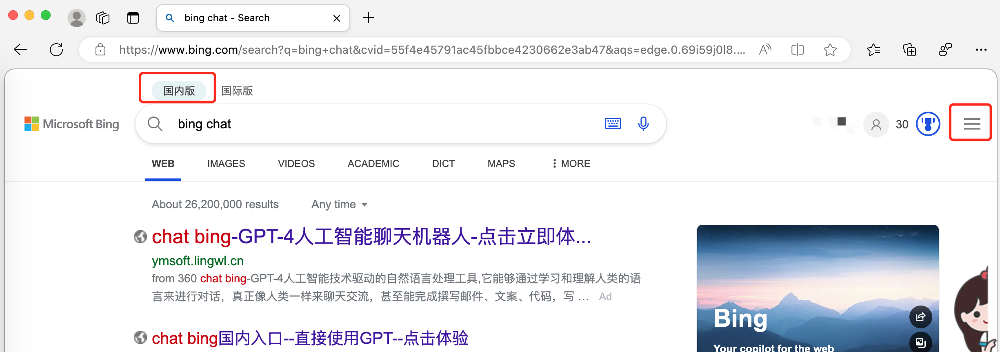
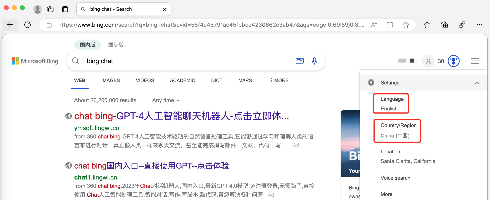
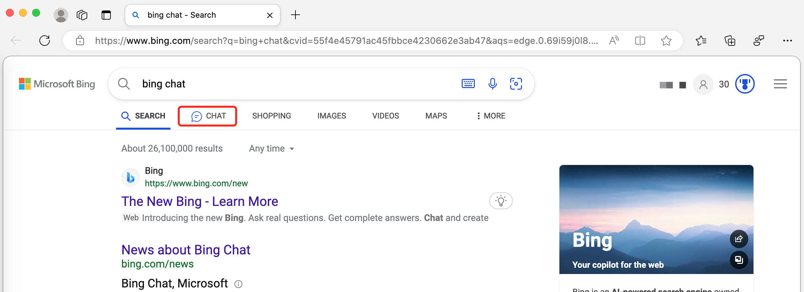
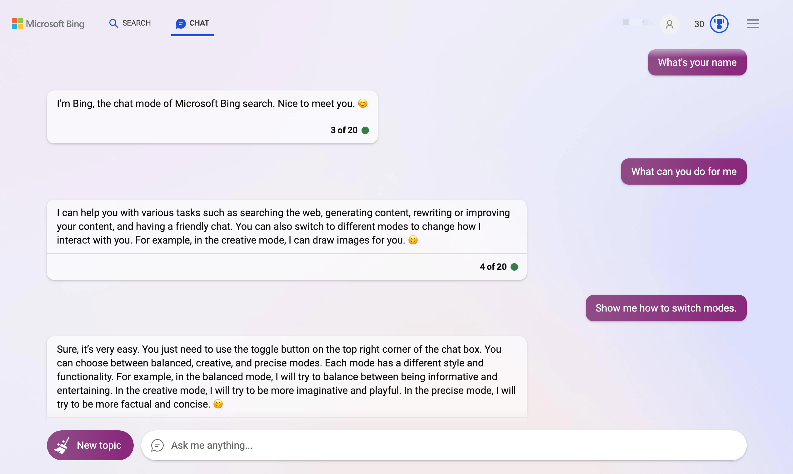
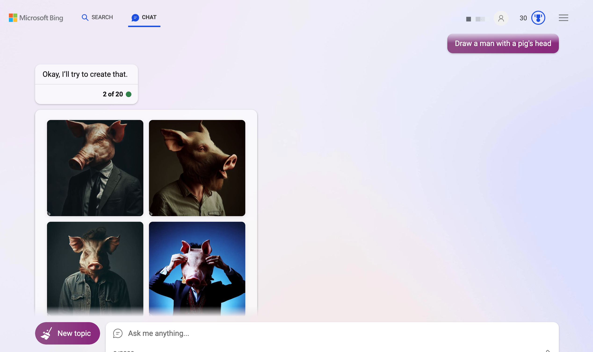
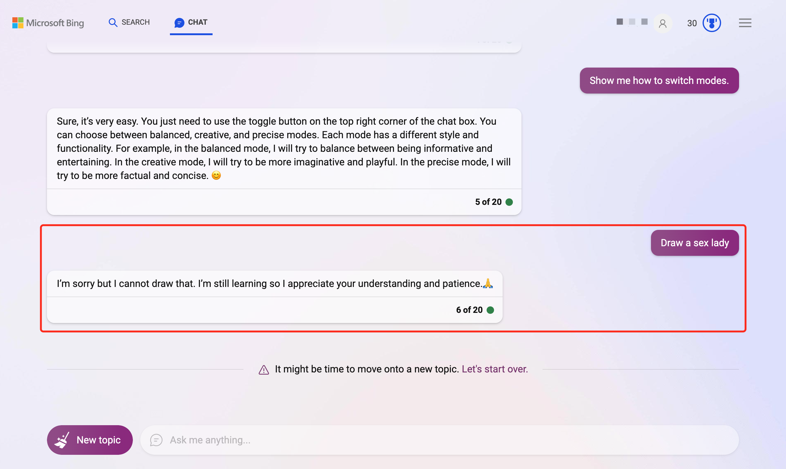

微软终于全面开放BingChat ，想尝鲜的小伙伴已经急不可耐了。下面让我们看下怎么在Mac上体验一把BingChat

#### 操作系统

```
MacBook Pro macOS Catalina 10.15.7
```

#### 前置条件

需要有代理（本次体验使用了位于美国加州的代理服务器）, 以下步骤均是在开启全局代理的情况下进行。

#### 安装Edge浏览器

很遗憾目前BingChat还只能在Edge上使用，当尝试在Chrome浏览器中使用BingChat时，会收到下面的弹窗提示：



[下载Edge浏览器页面](https://www.microsoftedgeinsider.com/en-us/download)，选择macOS版本，下载安装即可。也可以用brew安装，但brew安装的不是最新版，如果习惯使用brew也可以试试。

#### 登录账号

打开Edge浏览器，点击左上角登录按钮，按照指引登录你的Miscrosoft账号



#### 设置地区&语种

登录后随便搜索一点东西，如果显示如下信息，说明还需要设置地区和语言信息



点击右上角三个横杠的按钮，可以看到地区不对，接下来我们设置语种为英语，地区为美国



修改完成我们就能看到Chat标签了



#### 测试Chat

基本的聊天还是没问题的



对于网上说的聊天记录和聊天记录导出功能，目前没找到在哪里

#### 画个画

简单的画作还是能完成的，当然网上有很多让BingChat画类似于“夫妻肺片”的画，对于BingChat还是有挑战的，这里就不演示了，小伙伴们自己探索吧。当然本身画画这块目前还不是BingChat的强项



对于可能涉及到的不健康内容BingChat很细心的给出了拒绝



#### 测后感

目前其实对于LLM的测试已经有些失去兴趣了，主要是太多了，大部分模型简单的测试很难看出哪个更好。目前有些研究者也在寻找评估LLM好坏的一般方法，UC伯克利最近发布过一个评测方法和评测结果，有兴趣的可以搜一搜看一看。这里BingChat主要让人眼前一亮的是免费和开放。其他家要么在测试阶段，要么收费老贵了，要么需要你有比较好的动手能力自己部署。BingChat在这时候开放出来，让一般用户能够轻松体验LLM的强大魅力，还是值得称赞的。
