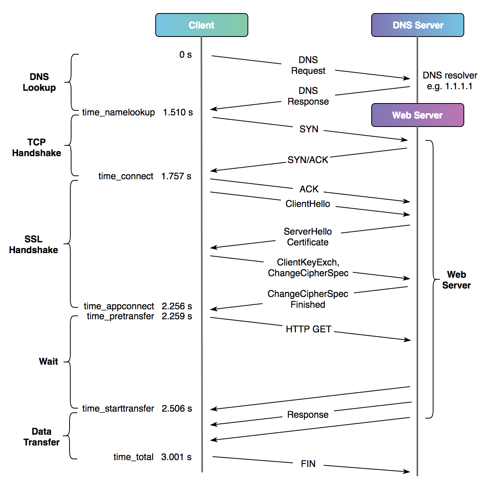
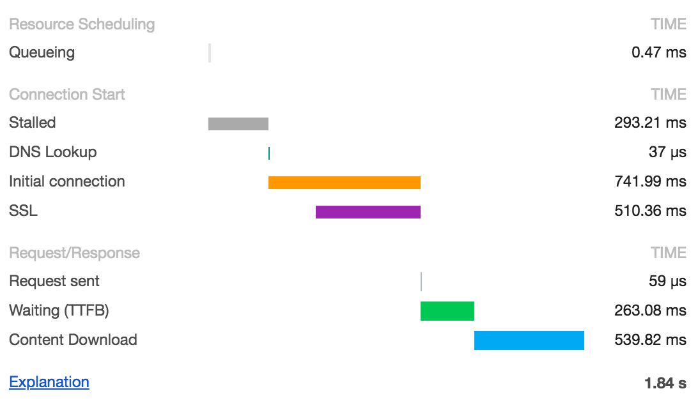

这是一篇翻译的[文章](https://blog.cloudflare.com/a-question-of-timing/)，当然也有一些修改。当我们想知道网站性能的时候，我们总会遇到一个词汇TTFB （time to first byte）。cURL 和 Chrome 是我们经常用到的工具，这篇文章会介绍怎么用这些工具观察各种时间指标，包括TTFB，同时会讨论这是不是我们想要的指标。

#### Timing with cURL

[cURL](https://curl.haxx.se/) 是一个很棒的WEB开发工具，它拥有时间测量的能力。我们来看一个例子，要访问的网站是百度 www.baidu.com，我们来看下从发出请求到得到响应都有哪些时间指标：

首先编辑`~/.curlrc`: 配置一下cURL的输出格式

系统信息:

```
~$ uname -a
Darwin bogon 19.6.0 Darwin Kernel Version 19.6.0: Tue Jan 12 22:13:05 PST 2021; root:xnu-6153.141.16~1/RELEASE_X86_64 x86_64
~$ curl -V
curl 7.64.1 (x86_64-apple-darwin19.0) libcurl/7.64.1 (SecureTransport) LibreSSL/2.8.3 zlib/1.2.11 nghttp2/1.39.2
Release-Date: 2019-03-27
```

```
~$ cat .curlrc
-w "dnslookup: %{time_namelookup} | connect: %{time_connect} | appconnect: %{time_appconnect} | pretransfer: %{time_pretransfer} | starttransfer: %{time_starttransfer} | total: %{time_total} | size: %{size_download}\n"
```

现在我们请求一下百度，由于我们不关心返回值，所以可以直接将输出重定向到 `-o /dev/null`

```
~$ curl -so /dev/null https://www.baidu.com
dnslookup: 0.109101 | connect: 0.136887 | appconnect: 0.189107 | pretransfer: 0.189172 | starttransfer: 0.211350 | total: 0.211542 | size: 2443
```

时间单位是"秒"。如果你的系统环境和我的不一样，输出的小数位数可能会有所不同。200毫秒看起来很快（毕竟百度），但这还只是一个请求，正常获取一个完整的页面，请求比这个多太多了，比如要加载大量的图片、脚本和样式等。

下图展示的是一个典型的使用TLS1.2协议的安全http连接的网络交互过程（直接使用了原图，所以跟上面的时间对不上）：



- **time_namelookup** 是DNS解析的时间，上图中的例子，这一步花了不少时间。为了排除DNS解析慢的问题，我们可以在curl命令后面 增加一个参数`--resolve www.baidu.com:443:39.156.66.18`。
- **time_connect** 是从客户端的角度来看TCP的三次握手的时间。在客户端发出ACK之后结束，不包括服务端收到这个ACK的时间。这个时间与RTT（round-trip time）比较接近。在这个例子中，RTT差不多200毫秒。
- **time_appconnect** 是加上TLS握手的时间。这之后客户端才真正发送GET请求
- **time_starttransfer** 是截止curl开始从网络中读取第一个字节的时间。`time_starttransfer - time_appconnect` 基本就是我们说的TTFB了，在这个例子中TTFB大约250毫秒。当然这段时间包括了一个RTT，所以更精确的计算公式是： `TTFB - (time_connect - time_namelookup)`。上面这个例子显示服务性能不错，只花了50毫秒左右给出了响应。
- **time_total** 是截止客户端发送FIN后连接断开时的总时间。

#### Timing with Chrome

Chrome 还有其他一些测试工具使用的是 [W3C Resource Timing standard](https://www.w3.org/TR/resource-timing/) 标准来计算各种时间指标。在Chrome浏览器的开发者工具中，一次网络请求大概向下图展示的样子：



这也是一个典型的使用TLS1.2协议的安全http连接的网络交互过程。我们把上图映射到时序图上，如下图：


- **Stalled** （从fetchStart到domainLookupStart）是浏览器执行建立连接之前的这段时间，比如：在磁盘上分配缓存；是否有高优先级的请求；是否已经存在了6个连接（这个是chrome的限制，同一个域名:端口默认最多建立6个TCP连接）
- **Initial connection** 对应上图的connectStart 到 connectEnd 这段时间，与cURL不同，它包含了建立SSL连接花费的时间，所以RTT的计算公式是：`Initial connection - SSL`。如果是重用了TCP连接，那么DNS Lookup、Initial connection 和 SSL 用时就都没有了，这也反映了使用HTTP/1.1的巨大好处。
- **Request sent** `requestStart - connectEnd` 这段时间基本可以忽略不计了
- **TTFB** 与cURL类似，如果我们要估算TTFB，可以这样算：`responseStart - requestStart - RTT`，从这个指标基本上就能看出服务的性能（服务实际处理请求用时）了。当然因为RTT本身不准确，所以只能算是近似。

#### What are we looking for again?

这些时间的测量，包括TTFB，有助于我们诊断问题，也可以为深入研究某些问题提供支持，而且也能反映出网站的性能？最终如果想找一个工具观测用户体验，仅仅看一个页面的TTFB是不够的。一个网站页面在可以点点点之前，可能需要下载数百个图片，一些JavaScript和css代码。为了真实反映用户使用体验，我们需要看这个页面从开始发送请求到可以点点点花了多少时间。具体如何测量这个时间，这就是另一个话题了，我们改日再聊 :)
